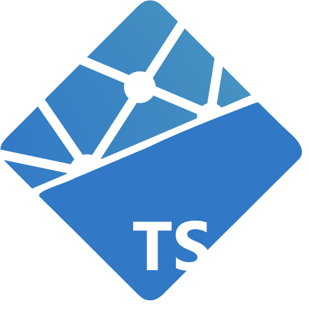

# netlify-lambda-ts

**👟 Building Netlify Functions with TypeScript easily**

📦 Package Manager agnostic

🐾 No production footprint

🚀 Ready to deploy

## ❯\_

### npm

```
npx netlify-lambda-ts
```

### yarn

```
yarn create netlify-lambda-ts
```

❓ Answer the questions and start coding!

## 🌲 File tree

```
 {{ package-name }}
  ├── src
  │   └── {{ your-function-name }}.ts
  ├── package.json
  ├── .babelrc
  ├── .gitignore
  └── netlify.toml
```

## 🧳 Installed dependencies

All depdendencies are installed as `devDependencies`, **netlify-lambda-ts** has no footprint on your production code.

### Required dependencies

| Package Name             | Why                                           |
| ------------------------ | --------------------------------------------- |
| netlify-lambda           | Adds build-step to Netlify Functions          |
| typescript               | The compiler for TypeScript (`tsc`)           |
| @babel/preset-env        | Tells Babel which JavaScript syntax to output |
| @babel/preset-typescript | Teach Babel to use TypeScript compiler        |
| @types/aws-lambda        | Request/Response types for AWS Lambdas†       |

†: Netlify Functions runs on top of AWS-Lambdas

### Optional dependencies

- [Netlify CLI](https://docs.netlify.com/cli/get-started/) To run Netlify Functions locally
- [Prettier](https://prettier.io): with some opinionated configuration

## 🛫 Flying solo

It‘s a dangerous road out there. Take these:

📹 [Write an API with Netlify Functions and TypeScript](https://www.youtube.com/watch?v=3-Ie6p5ySKQ)

🐙 [Monster As A Service](https://github.com/atilafassina/monster-as-a-service): written in TS, deployed to Netlify

✍️ [Netlify Functions 💜 TypeScript](https://atila.io/posts/netlify-functions-typescript)
